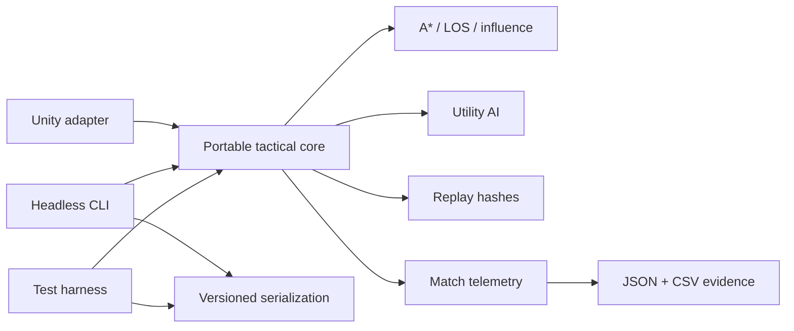

# Unity Tactical AI Sandbox

[](https://github.com/JasonStys/unity-tactical-ai-sandbox/actions/workflows/ci.yml)
[](https://github.com/JasonStys/unity-tactical-ai-sandbox/actions/workflows/codeql.yml)

A deterministic turn-based tactics laboratory built around a portable C# simulation core, a thin Unity adapter, and a headless balance-analysis tool. It demonstrates game AI, systems design, algorithmic reasoning, replay safety, data-oriented testing, designer-facing integration, and reproducible CI.

The project deliberately emphasizes engineering systems over art assets. Its original placeholder scenario is represented as data, while the interesting work—A* navigation, line of sight, influence fields, utility scoring, combat rules, replay verification, save migration, and bot telemetry—remains fully inspectable and testable.

## Portfolio highlights

- Deterministic, bounded A* with an admissible Manhattan heuristic and an `O(log n)` custom binary heap.
- Symmetric integer line-of-sight and distance-decayed influence maps.
- Explainable utility AI with stable tie-breaking and an explicit evaluation budget.
- Data-driven damage, range, cooldown, terrain cost, and cover rules.
- Cross-platform SplitMix64 encounter seeds instead of runtime-specific random behavior.
- Append-only command replays with canonical SHA-256 state fingerprints.
- Versioned save JSON with a tested legacy migration path.
- Headless bot tournaments with JSON and CSV balance telemetry.
- A `netstandard2.1` core usable from Unity and .NET 10 tools.
- A Unity adapter compiled against CI stubs to continuously verify its C# contract.
- Thirty-two dependency-free tests spanning examples, properties, regression budgets, replay tampering, and serialization.
- GitHub Actions on Linux and Windows, CodeQL, immutable action pins, minimum permissions, and Dependabot.

## System map



Unity owns presentation and authoring. The portable core owns rules and decisions. The headless layer owns files and batch operations. This separation keeps engine-dependent code small and makes game logic fast to exercise in CI.

## Quick start

Requirements: .NET SDK 10.0.401+ and Node.js 24+.

```bash
dotnet restore UnityTacticalAI.slnx --locked-mode --configfile NuGet.Config
dotnet build UnityTacticalAI.slnx -c Release --no-restore
dotnet run --project tests/TacticalAI.Tests/TacticalAI.Tests.csproj -c Release --no-build
dotnet run --project src/TacticalAI.Headless/TacticalAI.Headless.csproj -c Release --no-build -- demo
```

Run the complete local/CI gate:

```bash
npm test
```

Run a reproducible tournament and validate its replay:

```bash
dotnet run --project src/TacticalAI.Headless/TacticalAI.Headless.csproj -c Release --no-build -- simulate --matches 500 --seed 1000 --out artifacts/simulation
dotnet run --project src/TacticalAI.Headless/TacticalAI.Headless.csproj -c Release --no-build -- replay artifacts/simulation/sample-replay.json
```

Validate an authored scenario/save:

```bash
dotnet run --project src/TacticalAI.Headless/TacticalAI.Headless.csproj -c Release --no-build -- validate-save scenarios/duel-v1.json
```

## Major features

### Navigation and spatial reasoning

`GridAlgorithms.FindPath` finds minimum-cost cardinal routes, supports dynamic blockers, and stops when its node-expansion budget is exhausted. `HasLineOfSight` uses integer supercover traversal so reversing endpoints returns the same answer. `BuildInfluenceMap` generates explainable threat scores for AI movement.

### Tactical rules

`TacticalEngine.Apply` is the single command boundary. It rejects invalid actors, blocked movement, occupied destinations, friendly targets, range violations, blocked shots, unknown abilities, and cooldown violations before advancing the turn. Cover reduces incoming damage, while every successful action emits structured events.

### Utility AI

`UtilityAgent.ChooseAction` enumerates legal attacks and useful moves, then scores damage, defeats, cover, range, and threat. Integer arithmetic and lexical command keys make equal-score decisions reproducible. The decision result includes the chosen score, an explanation, candidates evaluated, and whether the budget was exhausted.

### Replay and persistence

`ReplayService` records commands and a SHA-256 fingerprint after every step. Validation replays the commands from the initial snapshot and stops at the first rejection or hash mismatch. Save files and replay files are explicitly versioned; version-zero state-only saves migrate to version one.

### Simulation and telemetry

`SimulationRunner` executes bounded AI-versus-AI matches. The CLI exports win counts, draws, average turns, action distribution, damage, seeds, and final hashes as JSON and CSV. The checked-in 500-match evidence is regenerated byte-for-byte during CI.

### Unity boundary

`AbilityAsset` exposes combat values as a ScriptableObject. `TacticalSandboxController` runs seeded bot batches from the Inspector. Unity scripts are linked into a contract-test project with minimal stubs, catching ordinary C# and integration-boundary errors without pretending to replace Unity Edit Mode or Play Mode tests.

## Repository layout

| Path | Purpose |
| --- | --- |
| `src/TacticalAI.Core/` | Portable grid, combat, AI, encounter, replay, and simulation domain. |
| `src/TacticalAI.Serialization/` | Versioned JSON/CSV adapters isolated from the portable core. |
| `src/TacticalAI.Headless/` | CLI for demos, tournaments, replay checks, and scenario validation. |
| `src/TacticalAI.UnityBridge.Contract/` | CI-only Unity API stubs that compile-check adapter source. |
| `unity/Assets/TacticalAI/Runtime/` | Thin Unity-facing ScriptableObject and MonoBehaviour adapters. |
| `tests/TacticalAI.Tests/` | Dependency-free deterministic test runner and 32 tests. |
| `scenarios/` | Human-readable authored scenario/save fixtures. |
| `docs/` | Architecture, ADRs, operations, security, research, testing, and evidence. |
| `scripts/` | Cross-platform validation and generated code-index tooling. |
| `.github/` | CI, CodeQL, and dependency-update configuration. |

A generated symbol-by-symbol file summary with exact declaration lines is in [`docs/CODE_INDEX.md`](docs/CODE_INDEX.md).

## Complexity and budgets

| Operation | Complexity | Bound |
| --- | --- | --- |
| A* pathfinding | `O((V + E) log V)` time, `O(V)` space | Default 4,096 node expansions |
| Binary-heap push/pop | `O(log n)` | Open set cannot exceed discovered cells |
| Line of sight | `O(max(dx, dy))` | Map dimensions are at most 128 × 128 |
| Influence map | `O(width × height × sources)` | Small tactical boards and explicit source list |
| Utility selection | Candidate-dependent | Default 256 evaluations per decision |
| Match simulation | Turn-dependent | Default 200 resolved commands |
| Batch simulation | `O(matches × match work)` | Public API caps batches at 10,000 |

## Evidence

- [`docs/reports/VALIDATION.md`](docs/reports/VALIDATION.md) — validation matrix and latest results.
- [`docs/reports/BALANCE.md`](docs/reports/BALANCE.md) — 500-match outcome analysis.
- [`docs/reports/PERFORMANCE.md`](docs/reports/PERFORMANCE.md) — regression budgets and interpretation.
- [`docs/reports/generated/balance-report.json`](docs/reports/generated/balance-report.json) — machine-readable results.
- [`docs/reports/generated/balance-report.csv`](docs/reports/generated/balance-report.csv) — analysis-ready match rows.
- [`docs/reports/generated/sample-replay.json`](docs/reports/generated/sample-replay.json) — deterministic replay fixture.

## Documentation

- [Architecture](docs/ARCHITECTURE.md)
- [Game and AI design](docs/GAME_DESIGN.md)
- [Replay and save formats](docs/REPLAY_AND_SAVE_FORMATS.md)
- [Testing strategy](docs/TESTING.md)
- [Operations](docs/OPERATIONS.md)
- [Security](docs/SECURITY.md)
- [Limitations](docs/LIMITATIONS.md)
- [Research notes](docs/RESEARCH.md)
- [ADR: utility AI](docs/adr/0001-utility-ai.md)

## License

MIT. See [`LICENSE`](LICENSE).
